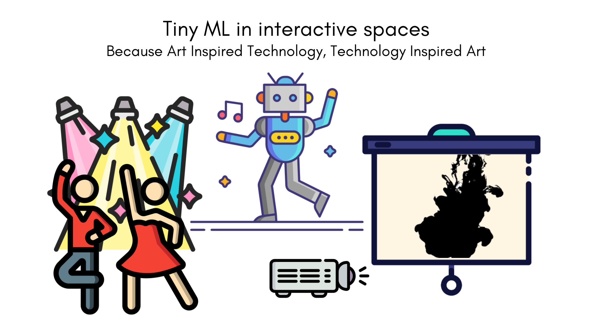

<!--#     The TensorFlow Microcontroller Challenge    -->
   <h1>:robot: :mechanical_arm: Tiny ML in interactive spaces code repo :mechanical_arm: :robot:</h1>

<!-- PROJECT LOGO -->
 

  
   

  
  
  
  

  
  
   <h3 align="center">Tiny ML in interactive spaces K-way Arduino Challenge project</h3>
  

    Because Art Inspired Technology, Technology Inspired Art
     
    <a href="https://projecthub.arduino.cc/projects/"><strong>View the project»</strong></a>
     
  

  

  
  

   

 

<!-- ABOUT THE PROJECT -->
## About The Project

<!--  -->

An intelligent device to track moves with responses during in a interactive space with mapping, backlight, music and smart sculptures. This project makes use of a machine learning algorithm capable of tracking and detecting moves to identify associated gesture recognition through a microcontroller. Smart sculptures, lighting, music and video projection to trigger with each assigned gesture, creating a powerful AV experience highlighting the incredible potential of TinyML for the performing arts. This allows the corresponding media set Tiny ML in interactive o play when the right move was made because all these elements interact to create a new experience. 

<!-- Content of the repository -->
## Content of the repository

Welcome to my repository on GitHub! This repository has been created specifically for the purpose of saving and organizing the codes for the Arduino K-way Challenge.

The Arduino K-way Challenge is a competition aimed at encouraging innovation and creativity in the use of the Arduino platform. Participants are tasked with creating projects that utilize the capabilities of the Arduino Nicla Sense ME board in unique and interesting ways.

In this repository, you will find the codes developed for my project submission to the Arduino K-way Challenge. Each code is well-commented and organized, making it easy for anyone to understand and build upon the project.

If you're interested in learning more about the Arduino K-way Challenge or developing projects using the Arduino platform, this repository is a great starting point. Feel free to explore the code and use it as a resource for your own projects.

Thank you for visiting my repository. I hope you find it useful!